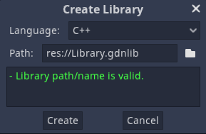
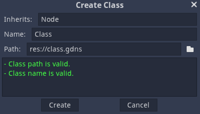
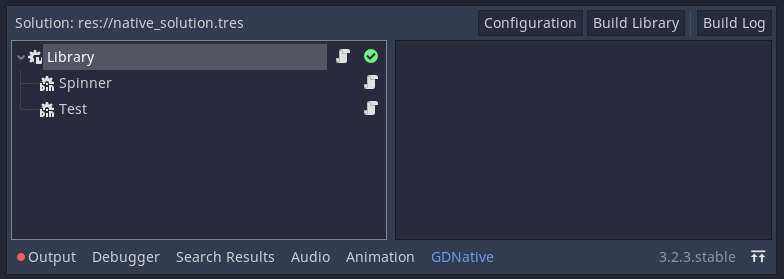
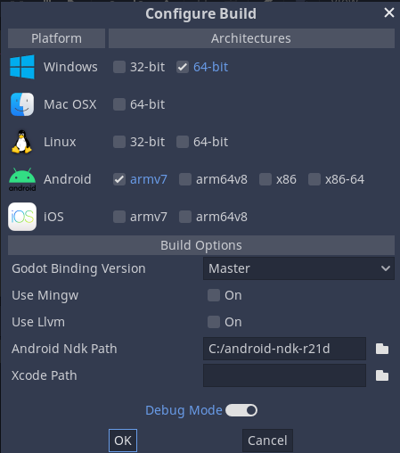

# GDNative Helper Plugin (WIP)

Hello Godot user! This plugin is meant to help you with programming in other languages via GDNative.
GDNative is a kind of "interface" between Godot and other programming languages. By using special C bindings, any language can be compiled into a static or dynamic library and be used by your game project through `GDNativeLibrary` and `NativeScripts`. The process of setting up and compiling those libraries can be a little, _tedious_ most of the times.
That's where this plugin comes in!

## TODO

* Building in C
* Test MacOS support
* Support iOS
* Add test for python and scons, among other tools

## Installation

All you have to do is place the `silicon.util.gdnative_helper` into your project's `addons` folder. Then enable it from the `ProjectSettings` and you should be good to go!

## Creating Libraries and Scripts

Upon enabling the addon, a `GDNative` tab should appear at the bottom. Open it, and the following interface will show up.

To create a library, simply press the `Create New Library` button. A popup will show up with what you need to set up to create said library.

Simple, right? Just press create and you've made a library!

The next step would be to create a class within your library. Select your library and press `Ctrl-Shift-A`. Change some settings, and press create!

By now, your UI will probably look similar to this.

## Editing your library's source code

The source files for your library and scripts are generated in a folder in `addons` called `gdnative_data`. By default, a `.gdignore` file is generated along with the library, so you can't see them in the Godot editor. to compensate, click the script icon beside the library or class to view its source code. Hold shift to view its header file, if it has any.

Programming in your library's configured language is out of scope of this plugin's capabilities.

## Building your libraries

Now. The moment you've been waiting for. Once you've written your code, you can now start building your code!
Press the `Build Library` button and the following dialog will appear.

From here, you may choose what platforms you may compile to, as well as whether it builds in debug mode not. There are also build options that appear depending on the language.

Unfortunately, depending on your platform, there are some limitations to cross-compiling. In the case of C++ as of writing:

* Windows users can't cross compile to Mac, Linux, or iOS.
* Linux users can't cross compile to iOS.

These problems can be solved by using a virtual machine for each platform and running and building your projects from there.

Once you're ready though, you can press the `Build Library` button and... wait. It will take a while for the building process to complete. In the case of C++, it will take even longer the first time since the bindings have to be compiled first.
If you have multiple libraries, you can also have those pending to build i.e., build when the other library is done.

Whether the building process succeeds or not, you'll find the errors, warnings and such in the space beside the list of libraries and classes. If the build process has succeeded, the static/dynamic libraries will be found in the `bin` folder for the built library. And that's pretty much it!
> **WARNING**: On Windows, if you have a built dll already, you might come across a permission access error. If that happens, you'll have to manually delete the older dll before you can rebuild your library.

## Multiple languages

The default languages are C++ and C. However, you may set up other languages too! The language templates that this plugin use are found in the `native_languages` folder in Godot's settings folder. To create a language template, you need the following files.

* `library_templates`: File(s) named `library_template` will be used by the plugin to generate a library. It can have any extension.
* `class_templates`: File(s) named `class_template` will be used by the plugin to generate a class. It can have any extension.
* `build.py`: The plugin runs this python script to build with.
* `config.json`: Additional per build data that is used by the build script.

## Contributing

You may create pull requests and suggest new features for this plugin as you wish. If you're not a programming guru, you can still contribute by donating to me via PayPal. It would really help. :)
